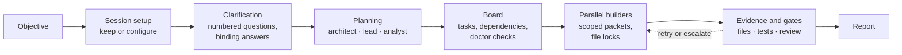
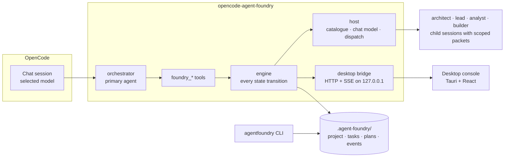

<p align="center">
  <picture>
    <source media="(prefers-color-scheme: dark)" srcset="https://raw.githubusercontent.com/gjoliveira9634/opencode-agent-foundry/main/assets/logo-dark.svg">
    
  </picture>
</p>

<p align="center"><strong>Hierarchical agent orchestration for OpenCode.</strong></p>

<p align="center">
  Agent Foundry is an <a href="https://opencode.ai">OpenCode</a> plugin that structures and coordinates
  specialized agents. It turns an objective into a governed execution plan: roles with distinct
  scopes and context budgets, a dependency-aware board, parallel builders and evidence-gated
  completion, observable from chat, a CLI and a native desktop console.
</p>

<p align="center">
  <a href="https://github.com/gjoliveira9634/opencode-agent-foundry/actions/workflows/ci.yml"></a>
  <a href="https://github.com/gjoliveira9634/opencode-agent-foundry/releases"></a>
  <a href="LICENSE"></a>
  
  
  <a href="https://opencode.ai/docs/plugins/"></a>
  
</p>

<p align="center">
  <a href="docs/getting-started.md">Getting started</a> ·
  <a href="docs/agents.md">Agent hierarchy</a> ·
  <a href="docs/execution-model.md">Execution model</a> ·
  <a href="docs/configuration.md">Configuration</a> ·
  <a href="docs/reference.md">Reference</a> ·
  <a href="docs/use-cases.md">Use cases</a>
</p>

<p align="center">
  
</p>

## Why Agent Foundry

Multi-agent setups that live entirely in a chat share three structural problems. Context relayed
through the coordinating agent is billed twice, once as its output and again as the worker's input.
Every agent receives the whole picture whether its task needs it or not. And "done" is accepted on
the model's word. Agent Foundry answers each of these with architecture rather than with prompting.

**Specialization by scope.** Five roles at four scope levels: the orchestrator owns the
conversation, the architect the project, the lead one module, the analyst one functionality, the
builder exactly one task. Each level receives a smaller context packet and costs less to run.

**Governed execution.** Step ordering is enforced in the engine, not only in the prompt: a plan
cannot be applied while a question is unanswered, evidence cannot be recorded for work that never
started, and a task cannot be reviewed before it reported evidence. Completion requires changed
files and passing tests; five review gates decide when a task is done; anchors protect human
decisions from being rewritten; failures climb an explicit escalation ladder.

**Cost control by construction.** The plugin dispatches roles itself through OpenCode's session
API, so a context packet is paid for once and reaches the role verbatim. Every role has a token
budget. Tool results are compact by design. The orchestrator prompt and all tool descriptions cost
about 1,400 tokens per turn, and the smoke test fails if the descriptions exceed their budget.

**Observability.** State lives in files under `.agent-foundry/`: a project record, one document
per task, full plans, and an append-only event log. Chat, the `agentfoundry` CLI and the desktop
console are three views of the same files, so they cannot disagree.

**Model independence.** A role is an organizational function; the model it runs on is
configuration. With no configuration every role inherits the model selected in the chat. Vendor
presets are a menu, never a default, and a binding applies on the next dispatch without a restart.

## How it works



The orchestrator opens every conversation with one question: keep the current setup, or open the
desktop console to change it. It records the objective, asks only what is genuinely ambiguous, and
turns the answers into binding decisions. Reasoning roles then plan at their own scope, and one
call turns a plan into board tasks with dependencies resolved. Execution starts every task whose
dependencies are met, up to the parallelism ceiling and subject to file locks, and each builder
receives a packet containing its task and nothing else. A task reaches `DONE` only after evidence
was validated and every required gate passed. The [execution model](docs/execution-model.md)
describes each step and the refusals the engine enforces.

## The hierarchy

| Role | Scope | Responsibility | Typical model tier |
|---|---|---|---|
| `orchestrator` | conversation | clarifies, plans onto the board, dispatches, reports | the model selected in the chat |
| `architect` | project | architecture, module boundaries, sequencing, acceptance anchors | strongest reasoning model |
| `lead` | module | decomposition of epics, module contracts, cross-module dependencies | strong reasoning model |
| `analyst` | functionality | precise, verifiable tasks; review of builder results | mid-tier model |
| `builder` | task | implements one task inside its declared files, returns evidence | fast, low-cost model |

Reasoning roles plan; the builder executes. Problems travel upward: builder to analyst to lead to
architect, each rung recorded with a reason. Every role runs with a tool allowlist matched to its
scope, so a builder cannot rewrite the plan it is executing. The [agent hierarchy](docs/agents.md)
documents each level's inputs, outputs, reasoning depth and cost position.

## Quick start

Requirements: OpenCode (the plugin is verified against the 1.18.x plugin API) and Node.js 20 or
later.

**Install as an OpenCode plugin.** Add the package to `opencode.json` in the project or in
`~/.config/opencode/`; OpenCode installs and caches it.

```jsonc
// opencode.json
{ "plugin": ["opencode-agent-foundry"] }
```

**Or run from source.** OpenCode loads a plugin entry directly when it starts with `file://`,
`./` or is an absolute path.

```bash
git clone https://github.com/gjoliveira9634/opencode-agent-foundry
cd opencode-agent-foundry
npm install && npm install --prefix web
npm run build
```

```jsonc
// opencode.json
{ "plugin": ["/absolute/path/to/opencode-agent-foundry"] }
```

**First run.** Restart OpenCode, select the `orchestrator` agent or type `/foundry` followed by an
objective, answer the session-setup question, then answer the clarification list. The plan appears
on the board, execution runs in parallel, and the orchestrator reports what was built with the
evidence behind it. The [getting started guide](docs/getting-started.md) walks through a complete
session.

## Model presets

Each preset fills all four configurable roles with an ordered candidate list. At setup time every
role resolves to the first candidate the account can reach; a role with no reachable candidate
inherits the chat model and the setup screen says so. Presets are a menu: nothing in them applies
until a human picks one.

| Preset | Architect | Lead | Analyst | Builder |
|---|---|---|---|---|
| OpenAI | GPT-5.6 Sol | GPT-5.5 | GPT-5.6 Terra | GPT-5.6 Luna |
| Anthropic | Claude Fable 5.1 | Claude Opus 5 | Claude Sonnet 5 | Claude Haiku 4.5 |
| Google | Gemini 3.1 Pro (preview) | Gemini 3.8 Flash | Gemini 3.8 Flash | Gemini 3.5 Flash-Lite |
| OpenCode Go | Kimi K3 | Qwen 3.8 Max | GLM 5.3 | DeepSeek V4 Flash |

`npm run check:presets` audits the table against OpenCode's model catalogue: every id must exist,
no primary may be an unstable build, the output-price ladder may not climb from architect to
builder, and each pick's age is reported. Deliberate exceptions are recorded in code with a reason.

<p align="center">
  
</p>

## Configuration

Configuration is optional. `agent-foundry.json` in the project overrides the same file in
`~/.config/opencode/`; every field has a default, and the JSON schema ships with the package.

```jsonc
{
  "$schema": "https://raw.githubusercontent.com/gjoliveira9634/opencode-agent-foundry/main/opencode-agent-foundry.schema.json",

  // Model per role. Empty means inherit the model selected in the chat.
  "models": { "architect": "", "lead": "", "analyst": "", "builder": "" },

  // Parallelism ceiling (0 = unlimited), file locks and retry budget.
  "execution": { "max_parallel": 4, "allow_file_overlap": false, "max_retries": 2 },

  // Context budget per role, in tokens. The main cost lever.
  "context": { "architect": 24000, "lead": 16000, "analyst": 12000, "builder": 8000 },

  // Estimated-spend ceilings; an exceeded limit surfaces a warning on completion.
  "limits": { "max_cost_per_task_usd": 0, "max_cost_per_project_usd": 0 },

  // Optional price table keyed by model id; no vendor pricing is compiled in.
  "pricing": { "<provider>/<model>": { "input_per_1k": 0.001, "output_per_1k": 0.004 } },

  "desktop": { "enabled": true, "autostart": false, "port": 0 }
}
```

The [configuration reference](docs/configuration.md) covers every field, preset resolution, the
migration from version 1 files and the environment variables. Ready-to-copy files are in
[`examples/`](examples/README.md).

## Desktop console

A native Tauri window with the dashboard, the Kanban board, the dependency graph with its critical
path, the task table, the live event log and settings. It connects to the plugin over a loopback
HTTP and SSE bridge authenticated with a per-start bearer token that never appears on a command
line or in a URL.

<p align="center">
  
  
</p>

The console is additive: the plugin is fully usable from chat and the CLI without it. Build it with
`npm run desktop:build` (Rust and cargo on `PATH`; `npm run desktop:doctor` reports what is
missing), or download a binary for Windows x64, macOS arm64 or Linux x64 from the
[releases](https://github.com/gjoliveira9634/opencode-agent-foundry/releases). Open it from chat
with `/foundry-ui`. Details, platform requirements and failure modes are in the
[desktop console guide](docs/desktop.md).

## Commands and tools

| Command | Purpose |
|---|---|
| `/foundry <objective>` | Start the flow for an objective |
| `/foundry-setup` | Keep the current setup, or open the console to change it |
| `/foundry-board` | The Kanban board, with what is blocking progress |
| `/foundry-status` | Phase, progress, running and blocked work, cost, doctor errors |
| `/foundry-next` | Execute everything that is ready, then run the review gates |
| `/foundry-graph [id]` | Dependencies, blast radius and the critical path |
| `/foundry-ui` | Open the desktop console |
| `/foundry-help` | Explain Agent Foundry without calling tools |

Twenty `foundry_*` tools back these commands: session setup; clarification (`start`, `ask`,
`answer`); planning (`consult`, `plan`, `apply_plan`); execution (`execute`, `next`, `complete`,
`fail`, `review`, `escalate`); and observation (`board`, `task`, `tasks`, `graph`, `doctor`,
`events`, `ui`). Results are compact JSON with a `next` hint, and refusals name the current state
and the call that fixes it. The `agentfoundry` CLI reads the same state for status, board, task
detail, graph queries, the doctor report and the event log. Every argument and result shape is in
the [reference](docs/reference.md).

## Use cases

Agent Foundry is designed for engineering work that benefits from decomposition, parallel execution
and verifiable completion:

- **Feature development across layers** such as multi-tenant row-level security in a database, an
  API and an admin UI, with contracts fixed by the architect before builders start.
- **Large-scale refactoring** such as splitting a monolithic notification module into provider
  adapters behind one interface, with contract tests as the acceptance anchor.
- **Technology migration** such as moving a front end from React 17 and Webpack to React 19 and
  Vite with no behavior change.
- **Production debugging** such as diagnosing intermittent gateway errors and landing regression
  tests alongside the fix.
- **Architecture review** such as auditing a payments module for boundary violations and producing
  a remediation plan.
- **Data pipelines** such as raw event ingestion into validated tables and aggregates, with
  backfill.

Each scenario in [use cases](docs/use-cases.md) shows the clarification questions, the
decomposition by role, a sample board, the evidence a builder returns and the gates that apply.

## Architecture



Agents and slash commands are contributed through OpenCode's `config` hook, and existing user
definitions win, so a project can override any of them. The engine owns every state transition and
appends every change to the event log; tools, the CLI and the bridge are views onto it. Roles run
as child sessions created through the host, with the model resolved from configuration at dispatch
time and a tool allowlist per role. The [architecture document](docs/architecture.md) records each
design decision, the cost model behind the packet budgets, and the invariants the smoke test
enforces.

```text
<project>/.agent-foundry/
  project.json      objective, phase, questions, decisions, anchors, cost totals
  tasks/<ID>.json   the source of truth per task: status, dependencies, evidence, gates, history
  plans/<ID>.json   planning payloads, kept out of project.json
  events.jsonl      append-only audit log
  desktop.json      bridge handshake, present only while the bridge runs
```

## Development

```bash
npm install && npm install --prefix web
npm run verify           # typecheck (plugin + web), backend tests, smoke, preset audit, web tests, style audit
npm run build            # plugin -> dist/
npm run smoke            # architectural invariants
npm run check:styles     # every className in the console resolves to real CSS in the built bundle
npm run check:presets    # preset ids exist in the catalogue, no unstable primaries, ladder descends
npm run desktop:build    # the native console (Rust and cargo on PATH)
npm run demo             # seed a sample project and hold a bridge open for the console
```

`npm run verify` is the gate, and it includes two audits that catch what a green build does not:
a stylesheet deleted while its class names remain gives a passing build and an unstyled console,
and a wrong preset id fails only at the first dispatch. The smoke test enforces the invariants that
keep the architecture honest: agent names never reference a model or vendor, the orchestrator has
no `model` key, presets stay inert until chosen, no execution modes exist, and tool descriptions
stay under their token budget. [CONTRIBUTING.md](CONTRIBUTING.md) describes the workflow and the
release process.

## Documentation

| Document | Covers |
|---|---|
| [Getting started](docs/getting-started.md) | Installation, the first session, where state lives, opening the console |
| [Agent hierarchy](docs/agents.md) | Each role's scope, inputs, outputs, reasoning depth, cost position, allowlists, extension |
| [Execution model](docs/execution-model.md) | Lifecycle, board states, scheduling, evidence, gates, escalation, doctor, refusals |
| [Configuration](docs/configuration.md) | Every field, presets and resolution, budgets, limits, migration, environment variables |
| [Reference](docs/reference.md) | Slash commands, all tools, the CLI, the bridge API, state files, event types |
| [Desktop console](docs/desktop.md) | Screens, connection and security model, building or downloading the binary, diagnostics |
| [Architecture](docs/architecture.md) | Components, design decisions, cost model, testing strategy, smoke-test invariants |
| [Cost and context](docs/cost-and-context.md) | Where tokens go, packet composition, budgets, single billing, tuning |
| [Use cases](docs/use-cases.md) | Six engineering scenarios with decomposition, sample boards, evidence and gates |
| [Troubleshooting](docs/troubleshooting.md) | Symptoms, causes and fixes, plus frequently asked questions |

## Contributing and security

Contributions are welcome; see [CONTRIBUTING.md](CONTRIBUTING.md) for the verification gate, the
load-bearing invariants and the release process. Report vulnerabilities privately through
[GitHub Security Advisories](https://github.com/gjoliveira9634/opencode-agent-foundry/security/advisories/new);
the trust model is described in [SECURITY.md](SECURITY.md).

## License

[MIT](LICENSE) © Gabriel José Oliveira
