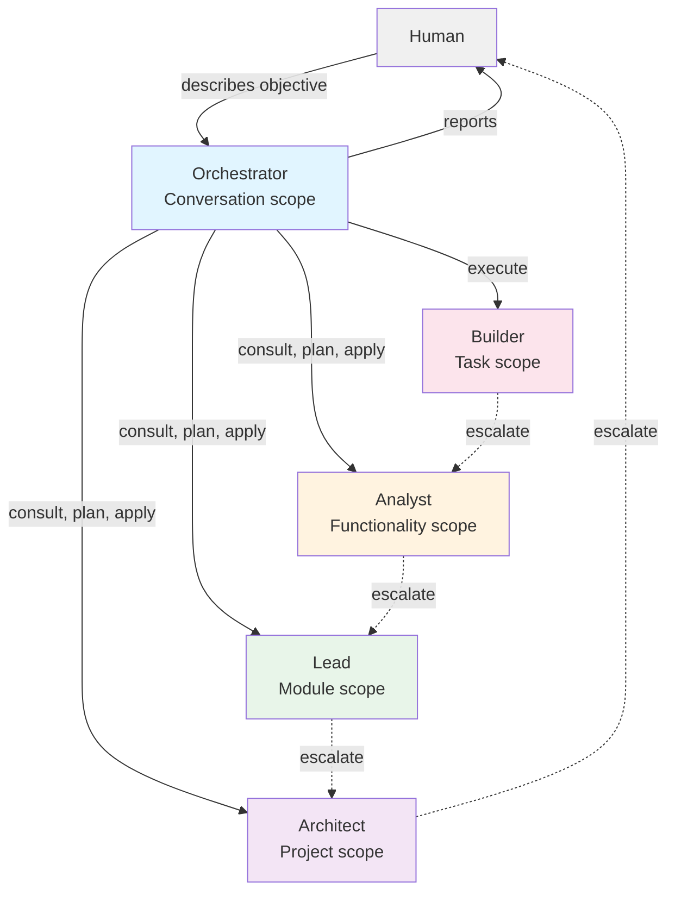

# Agent Foundry agent hierarchy

Agent Foundry organizes multi-agent work as a deliberate hierarchy of specialized roles. Each role
operates at a distinct scope level, receives a scoped context packet, and carries its own reasoning
depth and cost. This document describes the five roles, how they coordinate, how routing and
escalation work, and how to extend or customize the hierarchy.

## Overview diagram



## The orchestrator

The orchestrator is the human's interlocutor and the only entry point in the agent picker. It is
the only role that may ask questions; every other role reports upward instead of interrupting.

### Purpose

Coordinate a project from objective to completion. Clarify what is needed, assemble a plan from
reasoning roles, turn the plan into a Kanban board, dispatch builders in parallel, and report the
results.

### Scope level

Conversation scope. The orchestrator sees the full project, all questions and human decisions, and
the state of the whole board.

### Inputs

The orchestrator receives no context packet. It works directly in the chat with the results of
tool calls: board summaries from `foundry_board`, doctor reports from `foundry_doctor`, consult
answers from `foundry_consult`, and planning recommendations from reasoning roles. It sees
the state through these results, not through a separate packet.

The orchestrator runs on the chat model selected by the human, never on a configured binding.

### Outputs

The orchestrator produces:

- Clarification questions (recorded via `foundry_ask`)
- Plans assembled from reasoning roles (recorded via `foundry_plan`)
- Execution decisions (via `foundry_execute`)
- Evidence-gated completions (via `foundry_complete`)
- Review gate decisions (via `foundry_review`)
- Escalation decisions (via `foundry_escalate`)

### Typical task types

- Clarifying ambiguous objectives
- Synthesizing plans from architect/lead/analyst recommendations
- Deciding when to execute, retry, escalate, or block
- Reviewing evidence and deciding gates
- Reporting progress to the human

### Expected complexity

Orchestrator decisions are meta-level: choosing roles, reading evidence, deciding gates. The
reasoning depth is moderate; the coordination overhead is the dominant cost.

### Reasoning depth

Moderate. The orchestrator reasons about scope appropriateness, dependencies, and evidence
sufficiency, not about the technical work itself.

### Invocation frequency

Once per turn in most workflows. The human may invoke the orchestrator directly via `/foundry
<objective>`, or interact with its board (Kanban, graph, task list) via the desktop console or
CLI.

### Cost and quality position

Highest fixed cost (orchestrator prompt + tool descriptions ≈ 1,400 tokens per turn). Quality is
gated by evidence requirements, not the orchestrator's reasoning; human checkpoint decisions
interrupt its flow on destructive, contract-changing, ambiguous, external or conflicting work.

### When it delegates vs executes

The orchestrator never executes code. It delegates planning to the architect, lead, or analyst via
`foundry_consult`, and execution to the builder via `foundry_execute`. It makes all decisions about
what to do next (execute, retry, escalate, block) based on evidence and gates.

### Permissions and tool restrictions

The orchestrator may ask questions via `foundry_ask`. Every other role is denied the question
permission and must report upward instead. The orchestrator dispatches roles through the
runtime (OpenCode's session API), not through tool calls. Its only configuration-related access
is through `foundry_setup` (offered once per conversation).

## The architect

The architect decides project-level strategy and is the top of the escalation ladder. It sees the
entire project and bears responsibility for structure, contracts, and ordering.

### Purpose

Define the project architecture, module boundaries, sequencing constraints, and acceptance criteria
that nobody below the architect may rewrite.

### Scope level

Project scope. The architect sees all tasks and dependencies, spanning every module and
functionality area.

### Inputs (context packet)

The architect's context includes:

- Project objective
- All answered clarification questions (up to 12)
- Human decisions (up to 10)
- Acceptance anchors (up to 10)
- Board in scope: all tasks with status counts and up to 15 needing attention
- Notes from the orchestrator
- The focus task (if invoked to review or plan around a specific task) with files and blast radius

Budget: 24,000 tokens (min 1,000). Packets over budget are trimmed on a line boundary and marked
truncated.

### Outputs

The architect produces plans (recorded via `foundry_plan` with author "architect"):

- A summary of the architectural approach
- Proposals with title, objective, module, allowed_files, acceptance_criteria, verification,
  dependencies (depends_on), and priority
- Risks and open questions
- Tight allowed_files lists so no two proposals overlap unless one depends on the other
- "ref" fields so proposals within one plan can depend on each other

### Typical task types

- Global architecture and module boundaries
- Cross-module contracts and interfaces
- Sequencing and dependency graphs
- Major refactors or technology migrations
- Acceptance criteria that bind the whole project

### Expected complexity

High. Architectural decisions affect the entire project and ripple through all downstream work.

### Reasoning depth

Deep. The architect must think through trade-offs, constraints, and long-term consequences.

### Invocation frequency

Once or twice per project, at the beginning (clarification phase) and again if the architecture
needs rethinking (e.g., after a major failure). Rare compared to lower roles.

### Cost and quality position

Most expensive reasoning role. Quality is assured by the fact that every major architectural
decision becomes an anchor that lower roles cannot rewrite without escalation.

### When it delegates vs executes

The architect never builds code. It never decomposes to task level (that is the lead's and
analyst's job). It stays at the level where only it can work: contracts, structure, ordering,
blast radius, acceptance anchors.

### Permissions and tool restrictions

The architect cannot call setup or change configuration. It can consult (plan), but cannot
execute or apply plans directly; those decisions rest with the orchestrator.

## The lead

The lead owns one module and decomposes epics into work the analyst can turn into tasks. It owns
module contracts and cross-module dependencies.

### Purpose

Plan and review one module's work. Decompose epics into smaller stories. Define module boundaries
and cross-module edges. Review builder results in your module.

### Scope level

Module scope. The lead sees only tasks in its module, plus dependencies and dependents outside it.

### Inputs (context packet)

The lead's context includes:

- Project objective
- Answered clarification questions (up to 12)
- Human decisions (up to 10)
- Acceptance anchors (up to 10)
- Board in scope: tasks in the same module with status counts and up to 15 needing attention
- Focus task (if reviewing or planning around one) with files and blast radius (downstream and
  cross-module)
- Notes from the orchestrator

Budget: 16,000 tokens (min 1,000). Packets over budget are trimmed on a line boundary and marked
truncated.

### Outputs

The lead produces plans (recorded via `foundry_plan` with author "lead"):

- A summary of the module's approach
- Proposals for epics and their sub-tasks, with structured dependencies (depends_on/blocks)
- Cross-module edges expressed as explicit task dependencies, not prose
- Risks and open questions

### Typical task types

- Decomposing epics into work the analyst can define as tasks
- Module-level sequencing and contracts
- Cross-module dependencies and coordination
- Module reviews (when blast radius ≥ 3 or a public contract changes)

### Expected complexity

Moderate to high. Module design requires balancing internal coherence with external contracts.

### Reasoning depth

Moderate-to-deep. The lead reasons about module structure and cross-module dependencies, but does
not decide global architecture (that is the architect's job).

### Invocation frequency

Once per module, during planning. Invoked again to review when the blast radius warrants
(≥ 3 dependents or a contract change).

### Cost and quality position

Moderately expensive (second-most-expensive reasoning role). Quality is ensured by the review gate
that runs when a task touches the module's public contract or blocks three or more downstream
tasks.

### When it delegates vs executes

The lead never builds code. It does not go below the epic level; the analyst owns task-level
decomposition. It escalates to the architect for conflicts about global strategy, recorded with a
reason.

### Permissions and tool restrictions

The lead cannot call setup or change configuration. Like the architect, it can consult and plan
but not execute or apply plans directly.

## The analyst

The analyst turns a slice of a module (one functionality area) into precise, verifiable tasks a
builder can execute without asking questions. It reviews builder results and enforces quality.

### Purpose

Decompose one functionality into small, precise tasks. Define acceptance criteria, allowed files,
and verification commands. Review every builder result in the functionality area.

### Scope level

Functionality scope. The analyst sees only tasks in the same functionality area, plus dependencies
and dependents outside it.

### Inputs (context packet)

The analyst's context includes:

- Project objective
- Answered clarification questions (up to 12)
- Human decisions (up to 10)
- Acceptance anchors (up to 10)
- Board in scope: tasks in the same functionality with status counts and up to 15 needing
  attention
- Focus task (if planning or reviewing) with files and blast radius
- Notes from the orchestrator

Budget: 12,000 tokens (min 1,000). Packets over budget are trimmed on a line boundary and marked
truncated.

### Outputs

The analyst produces plans (recorded via `foundry_plan` with author "analyst"):

- A summary of the functionality's work
- Small, precise task proposals with title, objective, allowed_files (narrow scope), explicit
  acceptance_criteria (checklist), verification command, priority
- Dependencies (both within the functionality and to other areas)
- Risks and open questions

### Typical task types

- Precise task definition (sub-story level)
- Narrow acceptance criteria and verification
- Quality assurance and review of builder results
- Escalation to the lead on module contracts or repeated builder failures

### Expected complexity

Moderate. Task definition requires precision without requiring deep architectural reasoning.

### Reasoning depth

Moderate. The analyst reasons about task boundaries, acceptance criteria, and decomposition, but
not about module strategy or global architecture.

### Invocation frequency

Frequently, once per functionality area during planning and again to review builder results.

### Cost and quality position

Moderate cost (third-most-expensive role). Quality depends on task precision: better decomposition
means smaller execution context, lower builder cost, and fewer retries.

### When it delegates vs executes

The analyst never builds code. It does not make architectural or module-level decisions (escalates
to the lead for those). It focuses on turning a slice of a module into tasks small enough that a
builder can finish them with certainty.

### Permissions and tool restrictions

The analyst cannot call setup or change configuration. It can consult and plan but not execute
or apply plans directly.

## The builder

The builder implements exactly one task inside its declared allowed_files and returns evidence. It
is the only execution role; all other roles are reasoning roles.

### Purpose

Execute one task to completion. Implement code, run tests, return evidence of work.

### Scope level

Task scope. The builder sees only one task: its title, objective, allowed files, acceptance
criteria, verification command, and any previous failures.

### Inputs (context packet)

The builder's context packet includes:

- Task ID and title
- Task objective
- Allowed paths (max 40 listed as bullets)
- Acceptance criteria (as a checkbox list)
- Verification command (if any)
- Anchors — immutable human decisions (never change these)
- Summary of the last failed attempt (if any)
- Evidence instruction: report files touched, commands run, tests run and their result

The builder never receives:

- The plan
- Other tasks
- The conversation
- Questions or human decisions
- Module or project context

Budget: 8,000 tokens (min 1,000).

### Outputs

The builder reports evidence via `foundry_complete`:

- `files_created`: paths of new files
- `files_modified`: paths of changed files
- `files_deleted`: paths of removed files
- `commands_executed`: commands run (names only; actual invocation is in the session log)
- `tests_executed`: test commands run
- `test_result`: 'pass', 'fail', or 'unknown'
- `output_summary`: key output or error (max 1,200 chars)

### Typical task types

- Feature implementation
- Bug fixes
- Test writing
- Refactoring within a narrow scope
- Documentation updates

### Expected complexity

Trivial to moderate. Tasks are scoped so a builder can finish them with certainty, or escalate
with a clear recommendation.

### Reasoning depth

Low. The builder focuses on execution, not reasoning. It reads the task brief, implements,
verifies, and reports.

### Invocation frequency

Every ready task runs once. Builders are dispatched in parallel up to the `execution.max_parallel`
ceiling. A failed task may run again after escalation and rework by a higher role.

### Cost and quality position

Cheapest role per invocation (budget 8,000 tokens vs 12,000–24,000 for reasoning roles). Quality
is gated by evidence requirements: "done" means files changed, tests ran and passed, and all
acceptance criteria checked.

### When it delegates vs executes

The builder never escalates to another role automatically (that decision rests with the
orchestrator, informed by `foundry_fail` and the validator's failure policy). It executes until
the task is complete and verified, or genuinely blocked — in which case it reports the failure
via `foundry_fail` or `foundry_escalate`, which the orchestrator records.

### Permissions and tool restrictions

The builder has the most restricted tool allowlist. It cannot call `foundry_setup`,
`foundry_plan`, `foundry_apply_plan`, `foundry_next`, `foundry_ask`, or `foundry_answer`. The
builder returns evidence and result text to the orchestrator, which records completion or
failure via `foundry_complete` or `foundry_fail`, and handles escalation via `foundry_escalate`
if needed.

## Role comparison table

| Dimension | Orchestrator | Architect | Lead | Analyst | Builder |
|---|---|---|---|---|---|
| **Scope level** | Conversation | Project | Module | Functionality | Task |
| **Context budget** | — (chat model) | 24,000 | 16,000 | 12,000 | 8,000 |
| **Typical inputs** | Questions, board, focus | Project, all tasks | Module, cross-module | Functionality, slice | One task, evidence |
| **Typical outputs** | Plan synthesis, decisions | Architecture, anchors | Epic breakdown, module | Tasks, criteria | Code, evidence, tests |
| **Reasoning depth** | Moderate | Deep | Moderate-deep | Moderate | Low |
| **Invocation frequency** | Every turn | 1–2 per project | 1 per module | 1+ per functionality | Every ready task |
| **Cost position** | Highest fixed cost (1,400 tokens/turn) | Most expensive | Second-most expensive | Third-most expensive | Cheapest per run |
| **Execution** | Never | Never | Never | Never | Always |
| **Question permission** | Allow | Deny | Deny | Deny | Deny |
| **Dispatch capability** | Yes (via runtime) | No | No | No | No |

## Flow between levels

### The coordination cycle

Agent Foundry follows one execution flow, enforced in the engine and reflected in language:

1. **Setup** — Once per conversation, the orchestrator offers to keep the current setup or open the
   desktop console to change it (model bindings, context budgets, parallelism settings). This
   decision becomes binding for the run.

2. **Clarification** — The orchestrator starts the project in CLARIFYING phase, identifies gaps in
   the objective, records questions with `foundry_ask`, and puts them to the human as one numbered
   list. The human answers; each answer becomes a binding human decision recorded by `foundry_answer`.

3. **Planning** — Move to PLANNING phase. The orchestrator consults architect (project scope), then
   lead (module scope, if needed), then analyst (functionality scope, if needed). Each consultation
   delegates the role via OpenCode's session API; the role calls `foundry_plan` internally to record
   its proposals. The orchestrator then applies all plans with `foundry_apply_plan` in one call,
   which creates all tasks from all proposals and resolves their dependencies. Refused if any
   question is unanswered.

4. **Validation** — The orchestrator runs `foundry_doctor`, which checks for cycles, missing
   dependencies, file overlaps, and other structural problems. Every error must be fixed before
   executing.

5. **Execution** — Move to EXECUTING phase. The orchestrator calls `foundry_execute`, which runs
   every ready task in parallel (up to the parallelism ceiling). Each builder receives its own
   context packet and works independently. The orchestrator records each result with `foundry_complete`
   (task moves to REVIEW) or `foundry_fail` (task stays IN_PROGRESS for retry/escalation).

6. **Review** — For each completed task, the orchestrator runs required review gates via
   `foundry_review`. A task cannot move to DONE until all required gates pass. Required gates are:
   - `execution` (always)
   - `test` (always)
   - `review` (always)
   - `architecture` (if downstream ≥ 3 or touches a contract)
   - `acceptance` (if downstream ≥ 5 or has anchors)

7. **Completion** — When the board is empty of open work, the orchestrator confirms via
   `foundry_board` and reports what was built.

### Escalation ladder

Escalation happens when a task fails and the builder (or lower role) cannot fix it. The ladder is
strict and unidirectional:

```
builder → analyst → lead → architect → (no further)
```

Each rung handles a different class of problems:

- **builder → analyst**: Task-level issues (implementation difficulty, unclear acceptance
  criteria, test failures, scope creep)
- **analyst → lead**: Module-level issues (contract conflicts, cross-module dependencies,
  repeated failures on multiple tasks in the module)
- **lead → architect**: Global issues (architectural conflicts, strategy changes, repeated
  failures across modules)
- **architect → (blocked)**: Architect failures are surfaced to the human

Escalation is a one-time decision per task. After escalation, the higher role receives the task
in its new context and decides retry, rework, or blocking for human input.

### Routing policy

`src/orchestration/router.ts` defines a routing policy, `routeTask`, that maps a routing context
(declared complexity, whether a public contract is touched, cross-module scope, failure count) to
the cheapest competent role. The engine does not call it and no tool exposes it; it documents the
intended policy, which the orchestrator applies through its choice of `foundry_consult` role and
through `foundry_escalate`. The policy reads:

- **3+ failures** → architect
- **2 failures** → lead
- **Global complexity** → architect
- **Cross-module + architectural** → architect
- **Architectural** → lead
- **Cross-module** → lead
- **Moderate or touches a public contract** → analyst
- **Moderate** → analyst
- **Trivial** → builder

Failure count is the signal the engine does track: every failed attempt increments the task's
`attempts`, and the last failure summary travels in the next builder packet, so repeated failures
at one level are visible evidence that the work belongs one level up.

### Failure policy

When a task fails, the validator returns a decision to the orchestrator: `retry` (while
`attempts <= max_retries`, default 2, configurable 0–10), `escalate` (once, to the next role
up the ladder), or `block` (surface to the human for a decision).

- Retry while `attempts <= max_retries`
- After retry budget is exhausted, escalate once to the next role
- After escalation is exhausted, block and surface to the human

The orchestrator may act on this decision via `foundry_fail` (to record the failure) and
`foundry_escalate` (to move the task up the ladder). A task is never looped forever; the cost
of one escalation is less than the cost of repeated cheap failures.

## Permissions and tool allowlists

### Question permission

Only the orchestrator may ask questions via `foundry_ask`. Every other role (architect, lead,
analyst, builder) is denied question permission and must report upward instead. If a builder
needs a clarification, it escalates to the analyst with the question included in the reason.

### Tool restrictions

Reasoning roles (architect, lead, analyst) and the builder are subject to tool allowlists that prevent
misuse at the tool layer. The orchestrator operates through OpenCode's session API rather than through
tool calls, so no tool allowlist applies to the orchestrator.

The builder has the most restricted access. It cannot call `foundry_setup`, `foundry_plan`,
`foundry_apply_plan`, `foundry_next`, `foundry_ask`, or `foundry_answer`. It executes code and
returns result text to the orchestrator, which records completion via `foundry_complete`,
failure via `foundry_fail`, or escalation via `foundry_escalate`.

Reasoning roles (architect, lead, analyst) cannot call `foundry_setup`. They can call `foundry_plan`
to record plans and `foundry_consult` to delegate to other roles, but the functional flow is that
the orchestrator handles plan application and task execution.

The orchestrator calls `foundry_consult` to delegate reasoning roles, `foundry_execute` to dispatch
builders in parallel, `foundry_complete` and `foundry_fail` to record outcomes, and `foundry_review`
to decide gates.

## Model binding and resolution

### No model key on the orchestrator

The orchestrator's agent definition has no `model` key. This is a deliberate invariant, enforced
by the smoke test. When there is no binding, OpenCode resolves the agent's model to whatever the
human selected in the chat. Changing the chat model changes the orchestrator immediately, with no
restart or re-registration.

Other roles carry a `model` key only when configured (architect, lead, analyst, builder). A role
with no binding also inherits the chat model.

### Dispatch-time resolution

Model bindings are resolved at dispatch time, not at registration time. This means a rebinding
applies on the next dispatch with no restart:

```bash
# Change the analyst's model
agentfoundry models --set analyst=anthropic/claude-sonnet-5
# Next time the orchestrator dispatches the analyst, the new model is used
```

This is the only mechanism that makes "change and apply now" true without restarting OpenCode.

### Presets as a menu, not a default

The plugin ships with four vendor presets (OpenAI, Anthropic, Google, OpenCode Go). These are
offered in the setup screen, but they are not defaults. With no configuration, every role inherits
the chat model. Presets are applied only when the human chooses one on the setup screen or via
`/foundry-setup`.

Each preset specifies candidate models for each role in descending preference. The setup resolver
checks each candidate against the live model catalogue and picks the first one your account can
reach. If no candidate is reachable, the role falls back to the chat model and is reported as
unavailable (with a suggestion to add an API key or subscription).

## System prompts and reasoning depth

Each role's system prompt is written in language, not code, and guides its reasoning without
naming a model. The prompts are measured to ensure the fixed per-turn cost stays within budget.

### Orchestrator prompt (≈ 770 tokens)

The orchestrator prompt instructs the role to:

- Run `foundry_setup` first
- Work through the flow (clarify, plan, apply, execute, review, report)
- Ask questions only about genuinely missing information
- Never paste context packets into the chat
- Report progress as deltas, not whole-board summaries
- Reject evidence that does not show tests actually running and passing
- Never rewrite anchors

The orchestrator is the most expensive step, not because its reasoning is complex, but because it
pays the fixed tool-description cost every turn.

### Architect prompt (≈ 310 tokens)

The architect prompt instructs the role to:

- Decide structure, not implement
- Return plans via `foundry_plan` (author "architect")
- Stay at the level only the architect can work at: contracts, module boundaries, acceptance
  anchors
- Give tight allowed_files lists to every proposal
- Use "ref" to let proposals depend on each other
- Be decisive and reuse decisions already recorded

The architect is the most expensive reasoning role because project-scope decisions ripple far.

### Lead prompt (≈ 223 tokens)

The lead prompt instructs the role to:

- Own one module's contracts and dependencies
- Express dependencies as structured data (depends_on/blocks)
- Submit plans via `foundry_plan` (author "lead")
- Review results when blast radius ≥ 3 or a contract moves
- Escalate to the architect for global strategy conflicts

The lead is the cheapest reasoning role because it has narrower scope than the architect and
analyst combined.

### Analyst prompt (≈ 258 tokens)

The analyst prompt instructs the role to:

- Produce small, precise tasks with narrow allowed_files and explicit acceptance_criteria
- Never let two independent tasks claim the same file
- Submit plans via `foundry_plan` (author "analyst")
- Review every builder result in the area
- Escalate to the lead on module contracts or repeated failures

The analyst is charged with the highest-leverage optimization: better task decomposition means
lower builder cost and fewer retries.

### Builder prompt (≈ 289 tokens)

The builder prompt instructs the role to:

- Execute exactly one task inside allowed_files
- Never decide architecture, change scope, reorganize the board, or edit anchors
- Always return evidence: files, commands, tests and result
- Fix errors within scope; escalate if stuck after retries

The builder is the cheapest execution role because the packet is minimal.

### Fixed per-turn cost

The orchestrator prompt (≈ 770 tokens) plus all tool descriptions (≈ 650 tokens) totals ≈ 1,400
tokens per orchestrator turn. This cost is fixed and paid once per turn, regardless of how many
roles are consulted or tasks are executed. Tool descriptions are sent every turn; flow guidance
hints in each tool result's `next` field are paid only when the tool runs.

## Extending the hierarchy

### Rebinding models

Rebind any role's model without restarting OpenCode:

```bash
agentfoundry models --set analyst=anthropic/claude-sonnet-5
```

The binding is persisted to the project config file. The next dispatch uses the new binding.
Models are identified as `<provider>/<model>` (the same id that appears in OpenCode's
catalogue). An empty binding means inherit the chat model.

### Tuning context budgets

Context budgets control how much context each role receives before trimming. Lower budgets cost
less; higher budgets give more context. Budgets are configured in `agent-foundry.json` or globally
in `~/.config/opencode/agent-foundry.json`:

```jsonc
{
  "context": {
    "architect": 20000,     // default 24000
    "lead": 12000,           // default 16000
    "analyst": 10000,        // default 12000
    "builder": 6000          // default 8000
  }
}
```

Minimum budget is 1,000 tokens per role. Packets over budget are trimmed on a line boundary and
marked truncated. Trimming happens at build time; roles never see incomplete information without
knowing it.

### Overriding agent definitions

User-defined agent definitions in `opencode.json` take precedence over the plugin's defaults.
If you define your own `analyst` agent with a different prompt or model, it will be used
instead:

```jsonc
// opencode.json
{
  "agent": {
    "analyst": {
      "description": "...",
      "prompt": "...",
      "model": "anthropic/claude-sonnet-5"
    }
  }
}
```

The plugin still registers all five roles through the config hook, but your definition takes
precedence. This allows local customization without forking the plugin.

### Invariants that must hold

When extending or customizing the hierarchy, these invariants are non-negotiable:

1. **Agent names are organizational functions, never model, vendor or version names.** An agent
   named "claude" or "gpt-lead" violates this invariant. The name is the role; the model is
   configuration.

2. **The orchestrator's agent definition has no `model` key.** It must inherit the chat model.
   Never add a default orchestrator model or bind it to a specific vendor.

3. **Tool allowlists stay in place.** Builders cannot plan or dispatch, reasoning roles cannot
   execute. These restrictions are cheaper and more reliable than instruction-only guards.

4. **No execution modes.** There is one flow (clarify → plan → execute → review). Do not reintroduce
   restricted/automatic/full execution modes.

5. **Tool descriptions stay under ≈ 700 tokens total.** They are re-sent on every request. Flow
   guidance lives in each tool result's `next` field, which is only paid when the tool runs.

6. **Step ordering is enforced in the engine, not only in prompts.** Refusals name the actual
   state and the fixing tool call. Do not move these checks into tool descriptions.

These invariants are enforced by the smoke test and must be preserved to keep the architecture
intact.

## See also

- [Execution model](execution-model.md) — lifecycle end to end, board statuses, gates and evidence
- [Configuration](configuration.md) — full reference, presets, context budgets, cost limits
- [Reference](reference.md) — slash commands, tools, CLI, bridge API, state files
- [Cost and context](cost-and-context.md) — where tokens go, budgets, practical tuning
