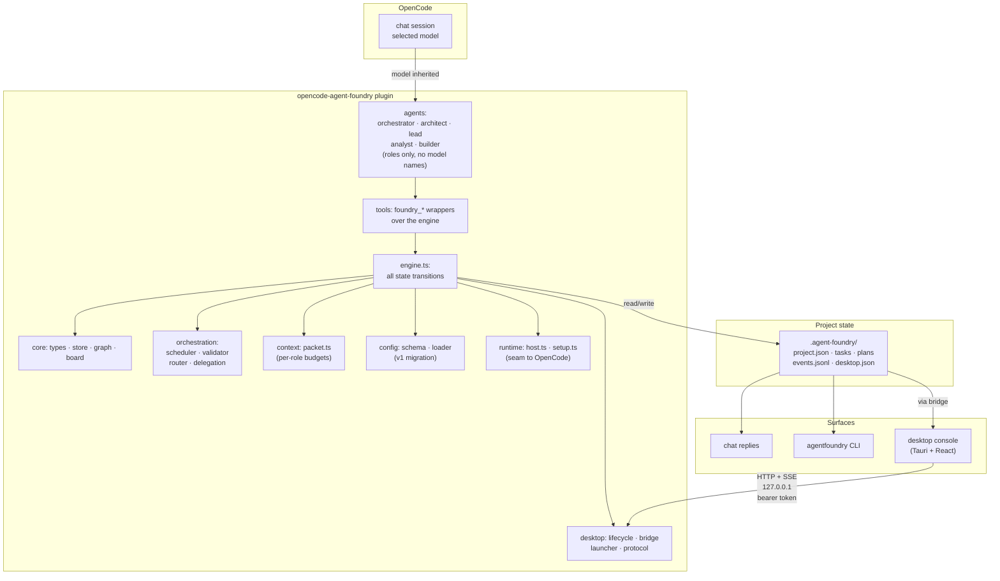

# Architecture

Agent Foundry structures specialized agents into a governed execution pipeline. This document
describes the component design, module map, key architectural decisions and their rationale, and the
invariants enforced by automated testing.

## Component diagram

## Module map

| Directory | Responsibility |
|---|---|
| `src/index.ts` | Plugin entry (`{ id, server }`). Registers tools directly; agents and commands through the `config` hook. |
| `src/core/types.ts` | Domain types: roles (never models), task status, edges, evidence, gates, anchors. |
| `src/core/store.ts` | File persistence: project state, tasks, plans, events. Capped history, atomic writes. |
| `src/core/graph.ts` | Work graph: dependencies, cycles, critical path, blast radius, file overlaps. |
| `src/core/board.ts` | Kanban projection: task statuses, status counts, summary view. Read-only, derived from tasks. |
| `src/orchestration/scheduler.ts` | Ready-to-run candidates: dependencies satisfied, ordered by priority and blast radius, file locks, parallelism ceiling. |
| `src/orchestration/validator.ts` | Evidence requirements, gate selection, required gates, failure policy. Completion validation. |
| `src/orchestration/router.ts` | Role routing by complexity and failure count; escalation targets; cost estimation; pricing and limits. |
| `src/orchestration/delegation.ts` | Packet building and dispatch; concurrent delegation with parallelism ceiling. |
| `src/context/packet.ts` | Context budgets per role; packet composition (project, answers, board, focus task); trimming and truncation. |
| `src/config/schema.ts` | Zod schema for configuration. All fields with type, default, validation. |
| `src/config/loader.ts` | Config file loading, v1 migration, precedence (defaults ← global ← project). |
| `src/config/presets.ts` | Vendor presets (OpenAI, Anthropic, Google, OpenCode Go): ordered role candidates, resolution. |
| `src/runtime/host.ts` | Interface to OpenCode: model catalogue, session model, dispatch, tool allowlists, offline fallback. |
| `src/runtime/opencode-host.ts` | OpenCode SDK-backed implementation of the host interface. Dispatch-time model resolution. |
| `src/runtime/setup.ts` | Session setup: configuration application (keep/inherit/preset/custom), session gate, runtime view. |
| `src/tools/engine.ts` | **All state transitions live here.** Stateful tools validate the board, enforce ordering, update state, append events. |
| `src/tools/definitions.ts` | Tool wrappers. Call engine, return compact results with `next` hints. |
| `src/desktop/lifecycle.ts` | Bridge and window ownership: independent startup/shutdown, single-instance enforcement. |
| `src/desktop/bridge.ts` | HTTP server on 127.0.0.1: bearer token auth, CORS, fixed endpoint list, SSE for live updates. |
| `src/desktop/launcher.ts` | Finds and spawns the native desktop binary per platform. |
| `src/desktop/protocol.ts` | Wire contract types (request/response shapes, no logic). |
| `web/` | React 19 + Vite + Tailwind + DaisyUI WebView app: Dashboard, Kanban, Graph, Tasks, Events, Settings. |
| `src-tauri/` | Rust shell: Tauri 2, single-instance plugin, WebView, IPC, handshake file handling. |

## Design decisions

### The orchestrator inherits the chat model by omission

`AgentConfig.model` is optional in OpenCode. When it is absent, the runtime resolves the agent to
the session's model. So instead of adding a "default orchestrator model" setting and keeping it in
sync with the chat, the orchestrator's agent definition simply has no `model` key.

**Consequences:** The user changes the model in the chat and the orchestrator follows, with no second
configuration surface and nothing to drift. The same mechanism gives the other roles a sensible
zero-config default: unbound roles also inherit the chat model, so a fresh install works with no
configuration at all.

### Agents are registered through the `config` hook, not returned

The `Hooks` interface in `@opencode-ai/plugin` exposes `tool`, `config`, `event` and `dispose` —
there is no `agent` key. Returning `agent: {...}` from the plugin is silently ignored. Agents and
commands are contributed by mutating the object passed to the `config` hook, which is what
`src/index.ts` does. Existing user definitions win, so a project can override anything.

**Consequences:** The plugin contributes the default agent definitions on every initialization. A
user's own agent or command in `opencode.json` will be preferred. This provides an override path
and keeps the plugin's own definitions minimal.

### The plugin dispatches roles; the orchestrator never relays a packet

The first design had the orchestrator delegate by typing the context packet into chat under an
`@builder` mention. Every packet was therefore billed twice — as the orchestrator's output tokens
and again as the builder's input — and the exact wording that reached the builder was whatever the
orchestrator chose to paraphrase, not what the code had budgeted.

Instead, `runtime/host.ts` is the seam: `catalogue()`, `sessionModel()` and `dispatch()`. The
OpenCode-backed implementation (`src/runtime/opencode-host.ts`) creates a child session and prompts
it directly. `orchestration/delegation.ts` builds the packet and sends it there.

**Consequences:**

- The packet is written by code and read by the role. It never enters the orchestrator's context.
- Each role gets a tool allowlist. A builder cannot call planning or dispatch tools at all.
- Concurrency is the plugin's decision, so `max_parallel: 0` can mean genuinely unlimited.
- The context packet is billed once, not twice.

An offline host (`OFFLINE_HOST`) is the default, so every path stays testable and headless use never
touches the network.

### Model rebinding cannot work through agent re-registration

OpenCode 1.18.x loads only v1 plugins (`{ id, server }`). A v2 plugin (`{ id, setup }`) does not load
at all. That rules out `ctx.agent.reload()` and any live re-registration: an agent's `model` is
frozen when OpenCode starts.

Configuration changes cannot reach a role through its agent definition. They reach it through
dispatch instead, which is resolved per call. This is the only mechanism by which "change the model
and it applies immediately" can be true on this runtime.

### The flow is enforced at the tool layer, not only in the prompt

The ordering used to live entirely in the orchestrator's system prompt. A model that lost the thread
could record evidence for a task that never ran, review one still in flight, or apply a plan while
its own questions sat unanswered — each producing a board that reports something that did not
happen.

`engine.ts` refuses those transitions outright: `foundry_apply_plan` with an unanswered question,
`foundry_complete`/`foundry_fail` on a task that is not `IN_PROGRESS`, `foundry_review` on one that
is not in `REVIEW`, and execution before a plan has produced tasks. Every refusal names the state
the task is actually in and the call that fixes it, so the model recovers in one turn.

**Consequences:** Tool descriptions can shrink — they no longer narrate the flow. The code enforces
it. Descriptions are re-sent on every request; a `next` hint costs tokens only on the turn its tool
runs.

### One execution flow

Execution modes (`restricted` / `automatic` / `full`) are gone: type, config field, tool, commands
and scheduler branch. The scheduler now always does the same thing — take everything whose
dependencies are satisfied, order by priority then by how much work it unblocks, and start as many
as the parallelism ceiling and the file locks allow.

The autonomy the modes provided is preserved by mechanisms that were doing the real work anyway:
`execution.max_parallel`, dependency gating, review gates, `execution.max_retries` with escalation,
and cost warnings.

### The Kanban board is a projection, not a second store

`tasks/*.json` is the only source of truth. The board is derived from it on demand (`src/core/board.ts`),
which is why the chat, the CLI and the desktop console can never disagree. Summaries are deliberately
small — the board is read by a language model on every check.

### The desktop bridge: HTTP + SSE over loopback

Considered: Tauri IPC proxying to Node, a WebSocket, and direct HTTP.

**Chosen:** HTTP for requests, SSE for live updates, both on `127.0.0.1`. Reasons, in the priority
order the requirements set out:

- **Simplicity** — the plugin already runs in a Node-compatible runtime; `node:http` needs no
  dependency, and the WebView's `fetch` needs no client library. Routing everything through Rust
  would mean re-implementing each endpoint twice.
- **Security** — loopback binding plus a per-process bearer token compared in constant time. The
  token reaches the page through a Tauri command, so it never appears in a URL, history entry or
  referrer. The handshake file is owner-only (0600) and deleted on stop.
- **Latency** — loopback HTTP is sub-millisecond; SSE pushes changes rather than polling.
- **Operational complexity** — one server, no protocol negotiation, no reconnect handshake beyond
  what SSE gives for free.

The surface is a fixed, small endpoint list. There is no filesystem, shell or proxy route, so a
hostile page inside the WebView cannot escalate through it.

### Two independent halves of the desktop feature

The bridge (a server) and the window (a process) are owned by `DesktopLifecycle` but are
deliberately decoupled:

- **Window closed, plugin alive** → the bridge keeps running, so reopening is instant.
- **Plugin stops, window alive** → the bridge closes and the UI shows a disconnected state with
  Retry. Killing a visible window because a plugin reloaded would be hostile.

Window reuse is enforced twice: the lifecycle will not spawn while a child is alive, and the Tauri
shell registers `tauri-plugin-single-instance`, which focuses the existing window and exits when a
second process starts.

The bridge is created lazily on first use (unless `desktop.autostart` is set), so a headless user
never pays for a server they will not open. Its socket is `unref`'d, so it can never hold OpenCode
open.

### Anchors

Human decisions, frozen contracts and acceptance criteria are recorded as anchors. `taskUpdate`
refuses a patch that removes or rewrites one and tells the caller to escalate instead. A system can
be perfectly self-consistent and still be solving the wrong problem; anchors are the fixed points
that make that detectable.

### Cost as a design constraint

A reference run of the earlier design built a small project and revealed where the tokens went.
Forensics and fixes:

| Finding | Remedy |
|---|---|
| `project.json` reached 39 KB, 98.7% duplicated planning payloads | Plans moved to `plans/<id>.json`; `project.json` keeps a compact ref list |
| Tool results were `JSON.stringify(task, null, 2)` including history, evidence and gates | Purpose-built summaries, unindented; detail is opt-in per call |
| One `foundry_task_create` call per task | `foundry_apply_plan` creates the whole plan, resolving refs to ids |
| 7 of 20 tasks cancelled on runtime file-lock conflicts | `WorkGraph.fileOverlaps()` reports overlapping independent tasks at plan time, via `foundry_doctor` |
| 1.9 attempts per task, unbounded history re-sent each retry | History capped at 3 attempts; `output_summary` truncated on write; packets carry only the last failure |
| Every event append re-read the whole log to compute a sequence number | Sequence cached in the store; counted once |
| `project.json` rewritten once per task creation | Project cached in memory, ids allocated in bulk, one `flush()` per operation |
| Dependency propagation rebuilt the graph per dependent | One graph, one pass |
| Four overlapping plans proposed the same tasks | Planning is scoped per author; the orchestrator prompt names this explicitly |

The largest remaining lever is context size, which is why `src/context/packet.ts` exists and why
each role has a token budget. The estimated fixed per-turn cost (orchestrator prompt + tool
descriptions) is approximately 1,400 tokens.

## Testing strategy

| Layer | Runner | Coverage |
|---|---|---|
| Backend | `node:test` against `dist/` | Config + v1 migration, store, graph, scheduler, validator, full engine lifecycle, bridge over real HTTP, launcher |
| Web UI | vitest + Testing Library | API client, SSE parsing, bridge resolution, board rendering, settings invariants, shortcuts |
| Desktop | `cargo test` | Argument/env parsing, handshake fallback, state management |
| Wiring | `scripts/smoke.mjs` | Plugin loads, tools present, agents registered via the config hook, no vendor names in agent identifiers, orchestrator without `model`, no agent carries a default model, no mode concept survives, task lifecycle reaches the board, tool descriptions within budget |

The smoke test encodes the architectural invariants, so a regression that reintroduces a hardcoded
model or an execution mode fails the build rather than shipping.

## Invariants enforced by the smoke test

The following properties are checked automatically on every build. Breaking any of them is an
architectural regression and requires explicit sign-off:

- **Agents are registered through the `config` hook**, not ignored as a return value.
- **Agent names and descriptions must never reference an LLM model, vendor or version.** Roles are
  `orchestrator`, `architect`, `lead`, `analyst`, `builder`. An agent's identity is its
  organizational function, never the model it happens to run on.
- **The orchestrator's agent definition has no `model` key**, so it inherits the chat model.
- **No agent carries a hardcoded default model.** With an empty configuration every role falls
  through to the model selected in the chat.
- **No execution modes.** There is one flow. No `restricted`/`automatic`/`full` tools, commands or
  configuration branches.
- **The plugin ships no model defaults.** Vendor presets are a menu, not a default. Nothing in
  `src/config/presets.ts` applies until a human picks it.
- **The orchestrator never relays a context packet through chat.** The plugin dispatches roles
  itself, so the packet is billed once and the model is resolved from config at dispatch time.
- **Tool descriptions stay under 700 tokens in total** (re-sent on every request; flow guidance
  belongs in the prompt and in each result's `next` field).
- **Step ordering is enforced in `engine.ts`**, not only in the prompt. Refusals name the state and
  the call that fixes it.
- **`max_parallel: 0` means unlimited**, not "none". `Infinity` must never reach a surface — the
  scheduler reports `0`.
