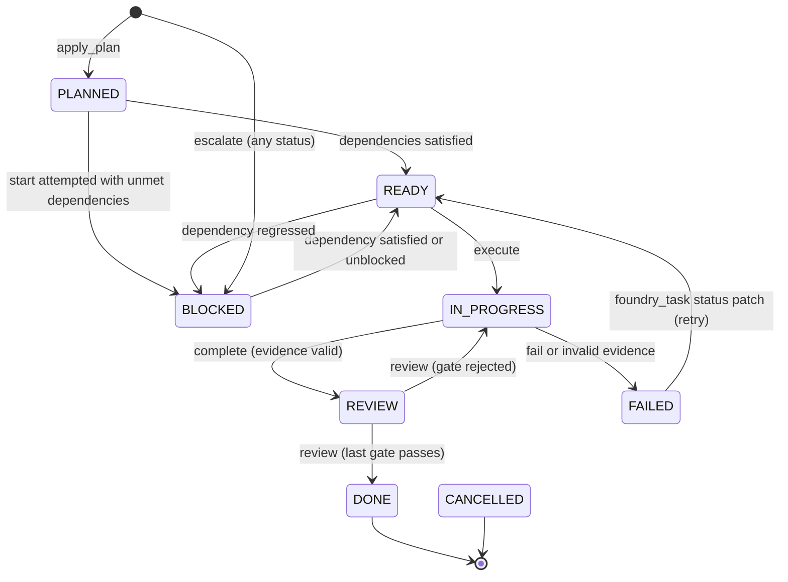

# Execution model

Agent Foundry turns an objective into a governed execution plan by orchestrating
specialized agents through a single deterministic flow. This document describes
the end-to-end lifecycle: how the project initializes, how tasks move from
planning to review, which state transitions are enforced, how work parallelizes,
and what stops execution when things go wrong.

## Overview

The execution model flows through four phases: **CLARIFYING** (gathering unknowns
from the human), **PLANNING** (deciding what to build and in what order),
**EXECUTING** (running tasks in parallel), and **REVIEWING** (passing evidence through
gates). Within a phase, tasks move through nine Kanban statuses as state transitions
are enforced by the engine.

Every state change writes to an append-only event log; the Kanban projection
reads from the same task files. The CLI, chat interface, and desktop console all
read the same files, so they cannot disagree about the board's state. The work
graph (tasks and their dependencies) is queried once per decision, never cached
between decisions, so it is always accurate when scheduling or checking
unblocking conditions.

## Session setup

Once per conversation, the orchestrator offers a setup question: keep the current
configuration or open the setup screen. This question fires with `foundry_setup(action="status")`.

The answer choices are:

- **keep**: use the current configuration without change.
- **configure**: open the desktop console's setup screen (the native window with
  the graphical preset picker). If the desktop console cannot open, falls back
  to the chat fallback.
- **preset**: the user selected a preset in chat (OpenAI, Anthropic, Google, or
  OpenCode Go). The setup applies that preset, resolving each role's candidate
  model against the live OpenCode catalogue.
- **custom**: the user supplied specific model bindings in chat. The setup
  applies them directly.
- **inherit**: clear all model bindings and execution/context/limit settings,
  reverting to defaults. On the next dispatch, each role inherits the model
  selected in the chat and uses default context budgets.

The setup result is written to the configuration file. A binding is read at
dispatch time, not at agent registration, so a model change applies immediately
on the next role delegation with no restart.

## Clarification

The orchestrator starts a project with `foundry_start(objective)`. This creates
the project directory (`.agent-foundry/`), initializes `project.json`, and moves
the phase to **CLARIFYING**.

Within clarification, the orchestrator gathers unknowns by calling `foundry_ask(questions)`.
Each question has two required fields:

- **question**: the text to put to the human (e.g., "What is the SLA for the
  cutover?").
- **why**: the rationale (e.g., "so we can decide whether to do it in-place or
  with a parallel run"). The why drives planning precision later.

The orchestrator presents all questions as a single numbered list and collects
replies via `foundry_answer(answers)`. Each answer pins a human decision and
becomes binding: agents in later phases receive these answers in their context
packet and must not silently override them.

When all questions are answered, the phase moves to **PLANNING** automatically.
Applying a plan while unanswered questions remain is refused; answering the last
question moves the phase on immediately.

## Planning

Planning is a reasoning phase where the orchestrator (or delegated roles) shape
the work and record it durably before any execution starts. Three tools move
planning forward:

**foundry_consult** runs a reasoning role (architect, lead, or analyst) on a
scoped context packet and returns its answer. The response is logged but does not
create tasks. Use it to ask for strategy, decomposition, or analysis before
committing to a plan.

**foundry_plan** records a plan from a role (usually the result of a consult).
The plan carries:

- **author**: which role or person created it (e.g., `architect`).
- **scope**: what the plan covers (e.g., `project-wide architecture`,
  `billing module`, `payment-retry functionality`). Per-author and per-scope so
  the system can track overlapping work.
- **summary**: a paragraph explaining the strategy.
- **proposals**: an array of tasks (proposal format). Each proposal names:
  - **title**, **objective**, **module**, **functionality** (optional; for
    scoping).
  - **allowed_files**: the files the executor may touch (glob patterns
    supported).
  - **acceptance_criteria**: checkboxes the executor must satisfy.
  - **verification**: optional command to run to prove completion.
  - **depends_on**: task ids or local refs (see below).
  - **ref**: a local handle so two proposals in the same batch can express
    ordering before ids exist (e.g., `ref: "database-migration"`, then another
    proposal `depends_on: ["database-migration"]`).
  - **priority**: 1–9; higher runs sooner (default 5).
  - **owner**: who owns this task when created (default: the plan's author).
- **risks**: optional risks or mitigations (not enforced, for logging).
- **open_questions**: optional questions this plan does not resolve.

When a new plan is submitted, the engine checks for earlier plans still
unapplied (never applied to tasks). If any are found, they are surfaced in the
response with a warning: planning that is paid for and discarded is pure waste.
The orchestrator must resolve unapplied plans deliberately — apply them or
supersede them.

**foundry_apply_plan** creates all tasks in a plan at once, resolving local refs
to task ids, and checking that all questions are answered. The entire plan is
created in a single atomic operation. Tasks start in **PLANNED** status; the
engine then immediately moves any with no unmet dependencies to **READY**. No
scheduling or dispatching happens in this call.

If any dependency points to a non-existent task id, that edge is dropped with a
warning (loose ends do not block creation). The engine then runs the graph to
check for cycles and overlaps, and the orchestrator must call `foundry_doctor`
and fix any errors before execution can start.

After applying a plan, the phase moves to **EXECUTING**.

## The board: statuses and transitions

The Kanban board tracks nine task statuses, each representing a discrete state:

| Status | Meaning |
|---|---|
| BACKLOG | created outside a plan, or a legacy status; never scheduled |
| PLANNED | included in an applied plan; dependencies may block it |
| READY | all dependencies satisfied; eligible to start |
| IN_PROGRESS | started; a builder has the packet and is working |
| REVIEW | execution reported evidence; awaiting review gates |
| BLOCKED | dependencies unmet, escalated, or awaiting human decision |
| FAILED | execution failed; decision pending (retry, escalate, or block) |
| DONE | all review gates passed; no longer changes |
| CANCELLED | explicitly stopped; terminal |

The scheduler starts only PLANNED and READY tasks.

Legal transitions are enforced by the engine. A task moves through this state
diagram:

A PLANNED task with unmet dependencies stays PLANNED with a `blocked_reason`
and only moves to BLOCKED if a start is attempted while dependencies are unmet.

The board is a projection: it is built from task files on demand, never cached
between reads. Every surface (CLI, chat, console) runs the same board builder,
so they show the same work in the same order.

### Dependency blocking and unblocking

A task's **depends_on** list holds task ids. A task is unblocked when every
dependency has status **DONE**. The engine checks this condition:

1. When applying a plan (tasks with no unmet dependencies move to READY).
2. When a task moves to DONE (the engine propagates upward, moving any newly
   unblocked tasks from BLOCKED or PLANNED to READY).
3. When trying to start a task (if dependencies are unmet, the task is moved to
   BLOCKED with a reason listing what it is waiting for).

A dependency on a non-existent task blocks forever (it is treated as unsatisfied).
The doctor reports missing dependencies as errors.

### Blocked state and blocked_reason

When a task moves to BLOCKED, it carries a **blocked_reason** explaining why
(e.g., `waiting for TASK-001, TASK-003`). If a task is manually moved to
BLOCKED without a reason, the doctor warns about it. A human escalates a blocked
task by calling `foundry_escalate(id, from, reason)`, which records the
escalation, updates the blocked_reason to indicate escalation to the next level,
and surfaces the task for the escalated role to decide on in their context
packet.

## Scheduling

The scheduler runs every time `foundry_next` or `foundry_execute` is called. It
is a pure function of task state (same input, same decision, always).

**Candidates** are tasks with status PLANNED or READY whose dependencies are
satisfied. Candidates are **ordered** by:

1. Priority descending (9 first).
2. Blast radius descending (how many downstream tasks depend, directly or
   transitively).
3. Task id lexicographically (tiebreaker).

The scheduler then **starts** as many candidates as the parallelism ceiling
allows and the file locks permit:

- **Parallelism ceiling**: configured as `execution.max_parallel`. A value of 0
  means unlimited; no task is deferred for parallelism reasons. A ceiling of 4
  means at most 4 builders run at once.
- **File locks**: when `execution.allow_file_overlap` is false (the default), two
  independent tasks that claim the same file cannot run together. The scheduler
  defers the second one with reason `file lock held by <id>`. This prevents race
  conditions on shared files. (Ordered pairs via dependencies are fine; the
  scheduler runs them in order anyway.) The doctor reports file overlaps between
  independent tasks as warnings, so conflicts are surfaced at plan time.

Deferred tasks are kept in the decision and returned to `foundry_next` so the
orchestrator can understand why work is waiting. A task deferred for file locks
becomes runnable as soon as the blocking task finishes.

The decision is a `SchedulerDecision` with four fields:

- **ready**: all candidates (dependencies met).
- **started**: the candidates that will start this turn (respecting ceiling and
  locks).
- **deferred**: candidates not starting (with reasons).
- **running**: how many tasks are currently IN_PROGRESS.
- **limit**: the configured ceiling (0 = unlimited; never Infinity).

## Execution

`foundry_execute` is the entire execution step in one call. It dispatches all
ready tasks to builders concurrently, within the configured ceiling:

1. The scheduler decides which tasks to start.
2. The engine marks them IN_PROGRESS and logs TASK_STARTED.
3. Each task's context packet is built (see packets below).
4. The engine calls `delegateMany` to dispatch all builders concurrently,
   bounded by `execution.max_parallel`.
5. Results arrive as they finish (Promise.all waits for all).
6. For each result, if the builder succeeded, the orchestrator must call
   `foundry_complete` with evidence. If the builder failed, `taskFail` is called
   automatically by the engine.

### Builder packets

A builder packet is minimal and focused:

- Task id, title, objective.
- Allowed files (up to 40 listed; more result in `…and N more`).
- Acceptance criteria as checkboxes.
- Verification command (if any).
- Anchors (immutable human decisions or frozen contracts the task cannot
  rewrite).
- Summary of the last failed attempt (if any), so the builder learns what went
  wrong.
- An instruction to report evidence: files touched, commands run, tests run and
  their result.

The packet does not mention the plan, other tasks (except as anchors), or the
conversation. Everything else is architect/lead/analyst scope. The builder sees
only its task and nothing more, keeping the packet small and the cost
predictable.

### Dispatch through the host

The host (`src/runtime/host.ts`) is the seam to OpenCode. It:

- Holds the model catalogue.
- Knows the current chat model.
- Dispatches a role to run the packet and tools under the session.

For each builder, the engine calls `host.dispatch(request)` with:

- **role**: `builder`.
- **prompt**: the packet text (exact, never paraphrased).
- **model**: the binding from config, or empty string to inherit the chat model.
- **tools**: the builder's allowlist (builder cannot plan, ask/answer questions,
  or dispatch; see `ROLE_TOOLS` in host.ts).
- **directory**: the project root (so the builder can read/write files).
- **title**: for logging (e.g., `builder: TASK-015 Migrate billing to events`).

The host runs the role and returns a `DispatchResult`:

- **ok**: true if the role finished normally.
- **text**: the response.
- **sessionID**: child session id, so the human can open the full transcript.
- **model**: which model actually ran (may differ from config if binding was
  empty).
- **error**: if ok is false, a summary of what went wrong.

The engine wraps this in a `DelegationOutcome`, which adds **estimated_tokens**
and **truncated** (computed from the packet size in characters, not from the
provider). The orchestrator calls `foundry_complete` with evidence from the
builder's response.

### Concurrency

`delegateMany` runs up to `max_parallel` builders concurrently. A ceiling of 0
means unlimited (all builders from a batch run together). Each builder works
independently; the orchestrator waits for all results before collecting evidence
from each one. This is why execution is fast: parallelism is real and costs are
proportional to the work, not to the number of turns spent describing it.

## Evidence and completion

When a builder finishes, the orchestrator calls `foundry_complete(id, evidence)`
to record what was built. The **evidence** object has these fields (all optional):

- **files_created**, **files_modified**, **files_deleted**: which files changed.
- **commands_executed**: what was run (e.g., `npm run build`).
- **tests_executed**: which tests ran (e.g., `npm test`).
- **test_result**: `pass`, `fail`, or `unknown`.
- **output_summary**: a paragraph about what happened.

The engine validates the evidence against the task's scope:

1. **At least one file must change** (created, modified, or deleted). A task that
   runs but edits no files has no effect.
2. **tests_executed must be non-empty AND test_result must be `pass`**. Both are
   required. A run that reports `pass` with no tests is an executor asserting a
   result it never produced.
3. **No files outside allowed_files** (glob patterns like `src/auth/**` are
   supported). Scope violations are rejected.
4. **Required gates** are determined by downstream scope and anchors:
   - **execution** and **test** always required.
   - **review** always required.
   - **architecture** required if the task has ≥3 downstream dependents or
     touches a public contract.
   - **acceptance** required if the task has ≥5 downstream dependents or carries
     anchors.

If validation passes, the task moves to **REVIEW** and the engine marks
execution and test gates as passed. If validation fails, the task moves to
**FAILED** with an error summary.

A task's **history** records the last 3 attempts (oldest entries are dropped).
Each attempt carries attempt number, timestamp, actor, result (success/failure),
error summary (if failed), and evidence. The builder's next attempt receives the
summary of the last failure so it can learn what went wrong without re-reading
the full history.

## Review gates

Every task has five possible review gates (in order): **execution**, **test**,
**review**, **architecture**, **acceptance**. Not all are required for all tasks
(see the completion section above).

A gate has a **status**: `pending`, `passed`, `rejected`, or `skipped`. When a
task lands in REVIEW, the engine ensures every required gate is in the gates
list with status `pending`.

Gates are decided by calling `foundry_review(id, gate, decision, reviewer, note?)`.
The reviewer passes `passed` or `rejected`. If passed, the gate is marked
passed. If rejected, the task returns to IN_PROGRESS with an error summary
(either from the note or a default).

**Gate order is enforced**: a role with decision authority for one gate should
pass it before or with the others, but the orchestrator may submit them out of
order. The engine re-sorts gates to the canonical order (execution, test,
review, architecture, acceptance) so the board always shows the same order.

When the **last pending gate passes**, the task moves to **DONE** automatically,
and the engine propagates upward to unblock dependents.

If any gate **rejects**, the task returns to IN_PROGRESS immediately. The
builder will try again.

## Failure handling

When a builder reports evidence that fails validation, or when `foundry_fail` is
called directly, the task moves to FAILED status. The engine calls
`decideOnFailure(task, maxRetries)` and returns a decision to the orchestrator:

1. **Retry** if attempts so far ≤ max_retries (default 2). The orchestrator can
   move the task back to READY (via `foundry_task` status patch) so the
   scheduler will pick it up again. The task's attempt counter and last failure
   summary carry into the next packet.
2. **Escalate** if retries are exhausted and the task has not yet escalated.
   The orchestrator calls `foundry_escalate(id, from, reason)` to record the
   escalation and move the task to BLOCKED.
3. **Block** if retries and escalation are exhausted. The task remains FAILED
   until a human intervenes by calling `foundry_escalate` or updating the task.

The decision guides the orchestrator's action, but the orchestrator is
responsible for moving the task out of FAILED status.

**Escalation** is triggered by calling `foundry_escalate(id, from, reason)`. The
engine records the escalation (from role, to role, reason, timestamp) and moves
the task to BLOCKED with a blocked_reason indicating escalation to the next
level (builder → analyst → lead → architect). The next level role's context
packet includes this task in its "needs attention" section, where they can
decide whether to fix it, ask for clarification, or escalate further to the next
level.

## Anchors

Anchors are immutable reference points: human decisions, frozen contracts, or
acceptance criteria the task cannot rewrite. When a task is created, certain
acceptance criteria can be marked as anchors (stored in the task's **anchors**
list by value).

The engine refuses any patch that:

- **Removes** an anchored acceptance criterion.
- **Rewrites** an anchored acceptance criterion (changes its text).
- **Removes anchors** themselves.

A task trying to make such a change is refused with a note to escalate or ask
the human to change the decision. This prevents silent drift: a system can be
internally consistent and still be solving the wrong problem. Anchors keep that
from happening.

## Doctor

`foundry_doctor` performs every health check the engine can do:

**Errors** (must be fixed before execution):
- Unknown dependency: depends_on entry points to non-existent task id.
- Dependency cycle: the depends_on graph contains a cycle (must be acyclic).
- Empty title: a task has a blank title.
- Self-dependency: a task depends on itself.

**Warnings** (surfaced but do not block execution):
- No acceptance criteria: a task carries none.
- BLOCKED without a reason: a BLOCKED task has no blocked_reason.
- Unbounded scope: a builder task has no allowed_files (can write anywhere).
- Independent tasks sharing files: they will serialize, not parallelize.
- Plans never applied: submitted plans were never applied to tasks.

The doctor also reports **stalled** work: IN_PROGRESS tasks unchanged for more
than 30 minutes (likely hung).

The doctor returns `ok: true` only if there are no errors (warnings do not fail
the check). The orchestrator must run it after applying a plan and fix all
errors before execution starts.

## Completion and reporting

When all tasks reach DONE or CANCELLED status, the engine moves the project
phase to **REVIEWING**. The orchestrator then confirms with `foundry_board` that
nothing is left to work on and reports: what was built, what evidence was
accepted, how much it cost, and what remains undone (if anything).

The event log holds every transition; the project summary shows totals by status,
critical path, open questions, and costs. The Kanban board is the visual hub: it
shows all nine columns and all tasks in their current state.

## Engine-enforced ordering

The engine refuses out-of-order transitions with a message naming the state and
the correct next call:

| Refusal | Required state | Call that fixes it |
|---|---|---|
| Apply plan with unanswered questions | All questions answered | `foundry_answer` |
| `foundry_execute` / `foundry_next` while CLARIFYING or PLANNING | EXECUTING | `foundry_answer`, then `foundry_plan` + `foundry_apply_plan` |
| `foundry_complete` on task not IN_PROGRESS | IN_PROGRESS | `foundry_execute` (or `foundry_review` if in REVIEW) |
| `foundry_fail` on task not IN_PROGRESS | IN_PROGRESS | `foundry_task` to set status directly |
| `foundry_review` on task not in REVIEW | REVIEW | `foundry_complete` |
| `foundry_task` status READY/IN_PROGRESS with unmet dependencies | Dependencies DONE | Finish dependencies or edit `depends_on` |
| `foundry_task` patch touching anchors | Refused | `foundry_escalate` or human decision |
| Any tool before `foundry_start` | Project initialised | `foundry_start` |

